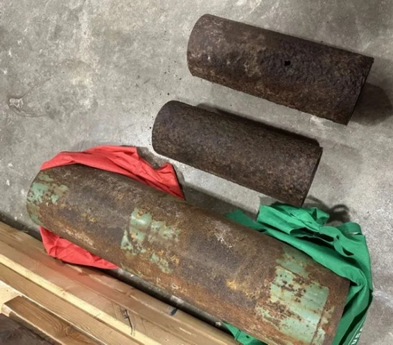
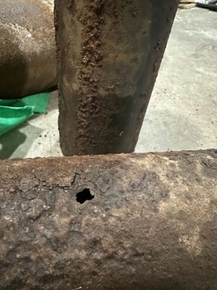
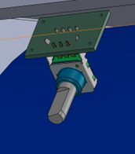
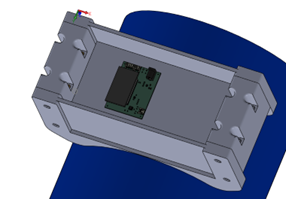

# February Session
## February 9, 2026
**Progress Highlights**
- Custom Hardware: Designed and fabricated the first revision of the sensing system PCB, moving from breadboard prototypes to a compact custom design.
- Component Procurement: Ordered high-precision amplifiers and signal-processing components from Digi-Key for the sensing circuitry.
- Data Acquisition: Developed Arduino-based firmware to capture and transmit analog sensor readings.
- IoT Connectivity: Configured the ESP32 as a WebSocket server to stream real-time sensor data over Wi-Fi.
- System Validation: Confirmed that early sensing electronics were producing measurable and stable signals.

**Electronics Fabrication and Component Sourcing**
February marked the project’s transition into the first iteration of custom hardware. The team completed the layout of the sensing PCB and submitted the board design for fabrication, allowing the sensing electronics to move from temporary breadboard circuits toward a more compact and reliable implementation.
To populate the board, the team placed a specialized order with Digi-Key for components required by the sensing architecture, including:
- High-precision amplifiers capable of detecting small changes in impedance within the sensing coils
- Signal-processing components designed to convert raw coil signals into measurable electronic data
This step was critical in transforming the sensing system from a conceptual circuit into a dedicated hardware platform.

**Firmware and Data Communication**
Alongside hardware fabrication, significant work was done on the software and firmware responsible for collecting and transmitting inspection data.
Key developments included:
- Signal validation: An Arduino-based firmware program was implemented to read analog sensor outputs and transmit the data through a serial interface. This allowed the team to verify that the sensing electronics were functioning correctly and producing consistent signals.
- Real-time data streaming: The ESP32 microcontroller was configured to operate as a WebSocket server, enabling the system to stream live sensor readings over Wi-Fi. This capability supports remote monitoring and will allow future inspection data to be visualized through graphical dashboards.
Together, these developments established the full data pipeline—from sensor hardware to wireless data transmission—laying the groundwork for future visualization and analysis tools.

---

## February 23, 2026
**Progress Highlights**
- Testing Infrastructure: Procured physical pipe samples to simulate real inspection environments.
- Mechanical Validation: Completed key mechanical calculations to ensure compatibility between the device housing and sensing hardware.
- Subsystem Coordination: Managed design dependencies between electrical and mechanical subsystems.
- Schedule Management: Mitigated fabrication and shipping delays by prioritizing firmware and networking development.

**Mechanical Testing Preparation**
To move toward real-world validation, the team began preparing the testing environment for the scanner device. This included acquiring physical pipe samples that replicate the surfaces and materials the device will encounter during industrial inspections.
The following samples will allow the team to evaluate how effectively the sensing system detects corrosion and other material changes while scanning along the pipe surface.

   
   

In parallel, the team completed several mechanical calculations to ensure the device housing and movement mechanisms would remain compatible with the finalized sensing hardware dimensions. These calculations help ensure that the sensing modules can be mounted securely while maintaining proper proximity to the pipe surface.

   
   

**Project Management**
February required active coordination between subsystems as the project moved into hardware integration. Two primary challenges emerged during this phase:
- Subsystem interdependency: Mechanical packaging decisions depended on the finalized dimensions of the fabricated PCB. As a result, the mechanical team temporarily paused final packaging design until the electrical hardware dimensions were confirmed.
- Fabrication lead times: PCB manufacturing and component shipping introduced unavoidable delays before full hardware testing could begin.
To mitigate these delays, the team adopted an agile development approach. While waiting for hardware to arrive, effort shifted toward advancing firmware development and networking architecture. This ensured that the software systems would be ready as soon as the physical electronics were available.
By the end of February, the project had progressed significantly toward a functional prototype, with hardware fabrication underway, sensing data successfully captured, and the communication infrastructure prepared for real-time monitoring and testing.
