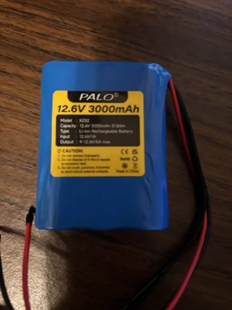
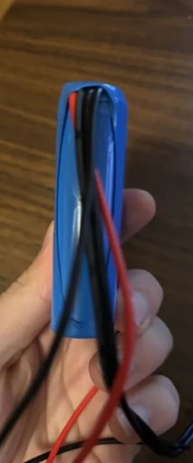
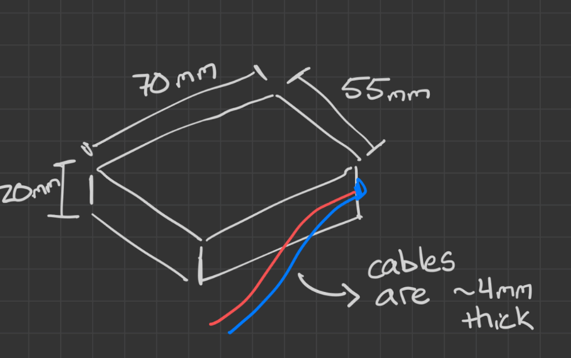
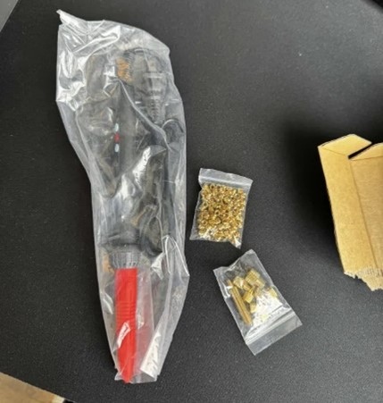

# January Session
## January 16, 2026
**Progress Highlights**
- Electronic Architecture: Began assembling the eddy-current sensing and signal-processing hardware stack.
- Component Procurement: Sourced instrumentation amplifiers, IC drivers, and other PCB components needed for impedance detection.
- Power & Control Setup: Selected the ESP32 as the main microcontroller platform and integrated a 12 V rechargeable battery for system power.
- Prototype Transition: Moved from theoretical circuit planning toward early hardware implementation and data acquisition.

**Sensing and Signal Processing**
The primary focus during January was on establishing the electronics required for the device inspection system. The team began assembling the eddy-current sensing subsystem, which will allow the device to detect changes in pipe material caused by corrosion or structural defects.
To support this sensing approach, several key electronic components were identified and ordered. These included instrumentation amplifiers and IC driver circuits capable of detecting small variations in the sensing coils' impedance. This hardware forms the basis of the device’s signal-processing architecture and will enable the system to convert raw coil measurements into usable inspection data.

**Power and Control Infrastructure**
Alongside sensing development, the team established the platform’s core control and power systems.
- Power Supply: A rechargeable 12 V battery was integrated to power both the device’s motors and electronics, enabling independent operation during inspection tasks.
  

  
  
  

  
  

    
  

<table align="center">
<tr>
<td></td>
<td></td>
<td></td>
</tr>
- Microcontroller Platform: Development began using ESP32 boards, which provide the processing and communication capabilities required for early-stage testing. These boards will serve as the central hub for sensor data collection and system control.

By the end of this phase, the project had moved beyond conceptual circuit design and into early hardware development, providing the core electronics infrastructure needed for future subsystem integration.

---

## January 23, 2026
**Progress Highlights**
- Mechanical Integration: Began transitioning from design to physical assembly by acquiring structural hardware.
- Assembly Preparation: Procured threaded inserts and installation tools for securing structural components.
- Structural Strategy: Established assembly methods for joining printed and machined components.
- Prototype Readiness: Prepared the mechanical framework needed for upcoming system integration and testing.

**Mechanical and Structural Integration**
Mechanical development progressed during January as the team began preparing the device’s structure for assembly. Efforts focused on acquiring and integrating the hardware needed to physically construct the prototype housing. These activities included:
- Acquiring threaded inserts and specialized installation tools.
  

   
  

- Establishing assembly methods for securely joining printed and machined components.
- Preparing structural mounting solutions to ensure stability during device movement.
These steps ensured that once electronic subsystems were ready, the device’s housing would be capable of supporting them.
January represented a turning point for the project as development moved from conceptual design toward implementation. With electronic components selected, power and control systems defined, and mechanical assembly hardware prepared, the team established the foundational infrastructure required for building the first integrated prototype.
