# March Session
## March 1, 2026
**Electrical**
- All electrical components were received.
- Meeting spent assembling and soldering the electrical components onto the PCB.

  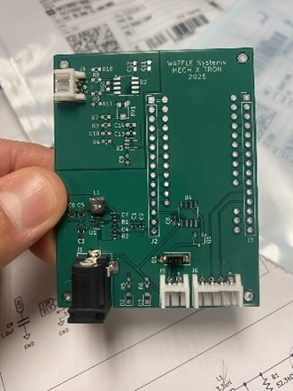 
  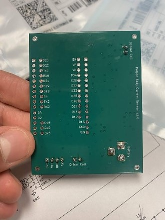 

**Mechanical**
- Printed and assembled first physical prototype, but significantly overestimated spacing requirements for the electronics – allowed for real-world spatial understanding of the device.

  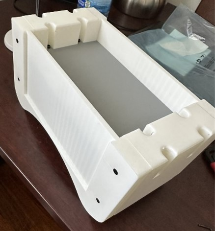 
  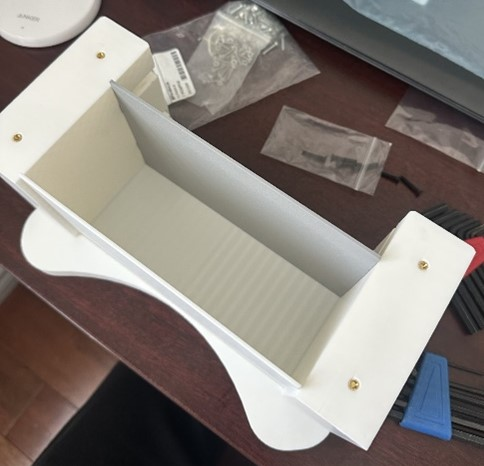 
  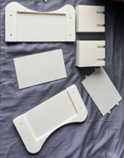 

---

## March 2, 2026
**Electrical**
- Continued assembling and soldering the electrical components onto the PCB.

  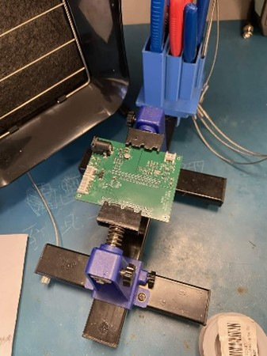 
  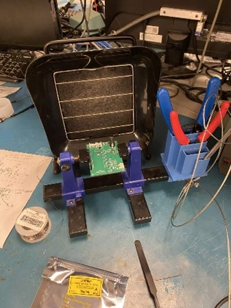 

**Mechanical**
- Re-imagined housing requirements with physical electronics and conceptualized a revised design.

  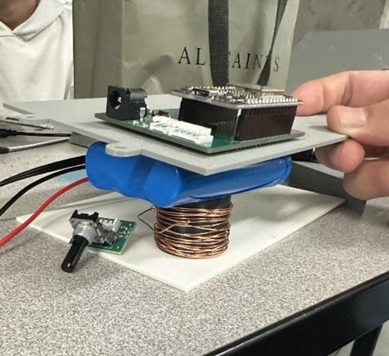 
  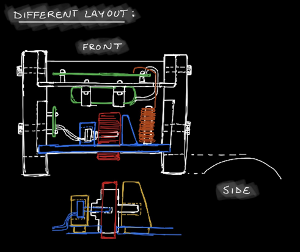 
  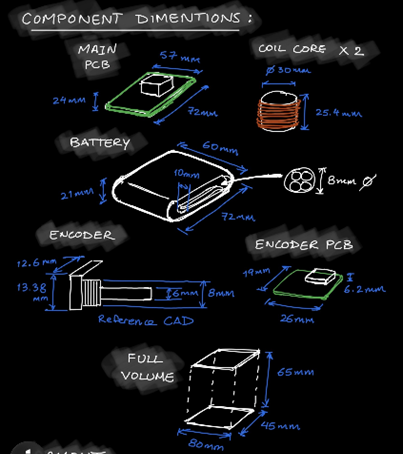 
  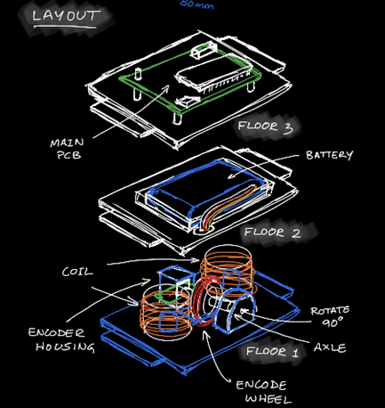 

---

## March 3, 2026
**Electrical**
- Finished assembling and soldering the electrical components onto the PCB.
- Increased pickup coil inductance using 38 AWG wire with 1,200 turns.
- Reduced driver coil inductance using 24 AWG wire with 150 turns.
- Changed coil orientation from side-by-side to stacked for improved axial sensing alignment.

  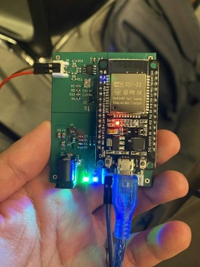 

**Mechanical**
- Redesigned the mechanical enclosure based on findings from previous iterations and printed.
<table align="center">
<tr>
<td>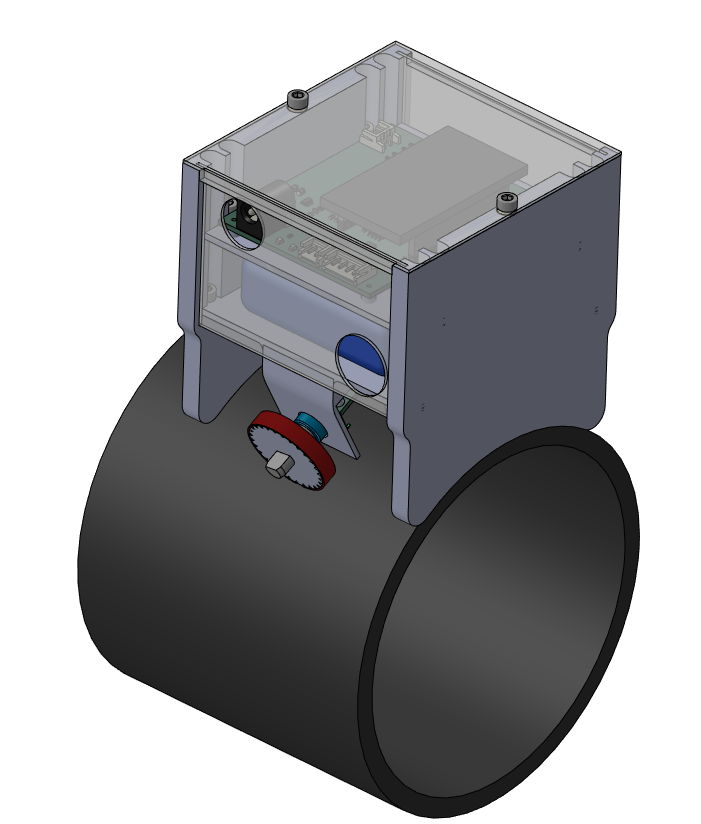</td>
<td>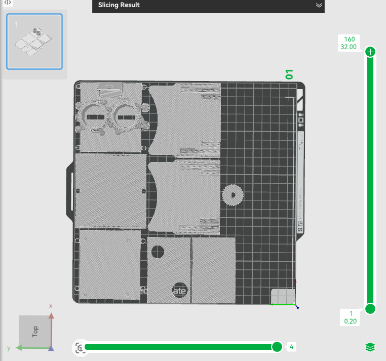</td>
</tr>
</table>

---

## March 5, 2026
**Electrical**
- Getting raw ADC value by wiring output before low pass filter, helped with debugging

  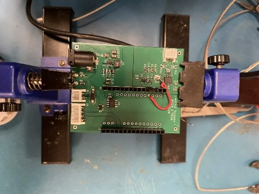 

**Mechanical**
- Printed and assembled the second physical prototype with the electronics - this allowed for fully integrated system testing.
- Ran into trouble heat-setting small parts – improper heat-setting led to misaligned panels in the final assembly.
- Noted DFM-based design improvement for the next revision.
<table align="center">
<tr>
<td>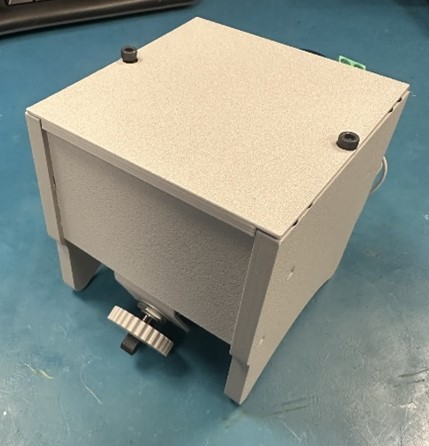</td>
<td>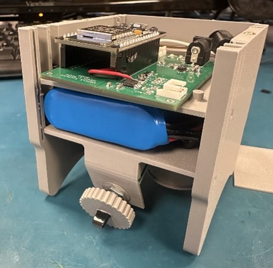</td>
</tr>
<tr>
<td>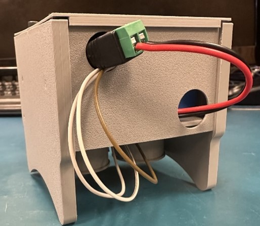</td>
<td>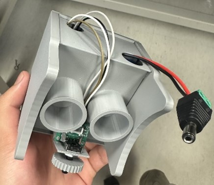</td>
</tr>
</table>

---

## March 7, 2026
**Electrical**

  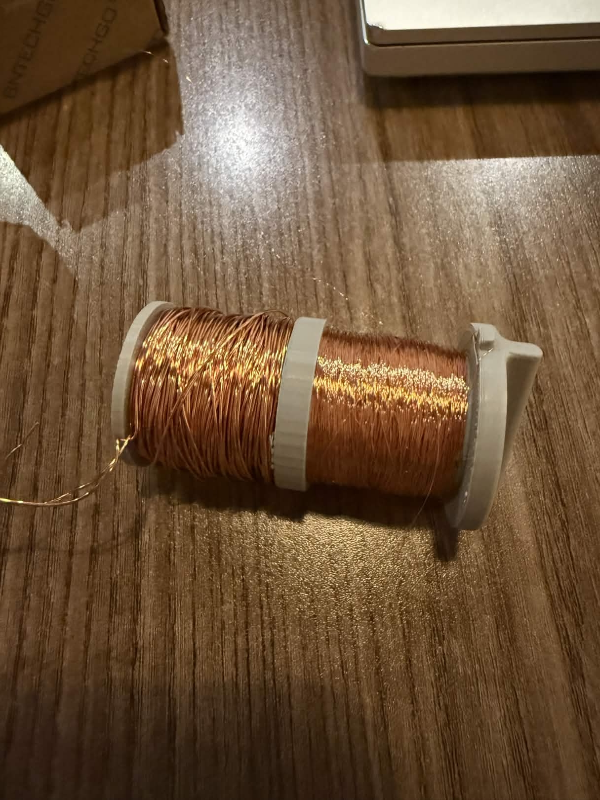 

- Pickup Coil (Sensing Coil)
  -- Requirements: High inductance for better sensitivity
  -- Coil Spec: 38 AWG
  -- 1,200 turns to maximize inductance and improve detection of impedance changes

- Driver Coil (Excitation Coil)
  -- Low inductance to generate fast, sharp pulses
  -- Coil spec: 24 AWG
  -- 150 turns

- Coil Orientation
  -- Changed from side-by-side to stacked configuration
  -- Aligns the excitation and sensing fields along the same axis
  -- Improves signal coupling and sensing accuracy

**Mechanical**
- Redesigned enclosure for vertical layout instead of the previous horizontal design
<table align="center">
<tr>
<td>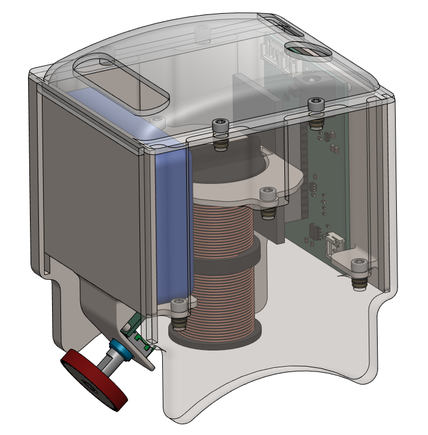</td>
<td>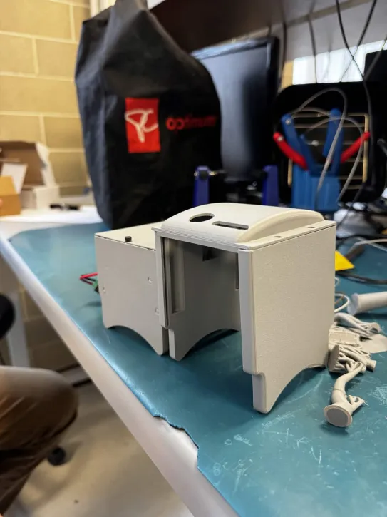</td>
<td>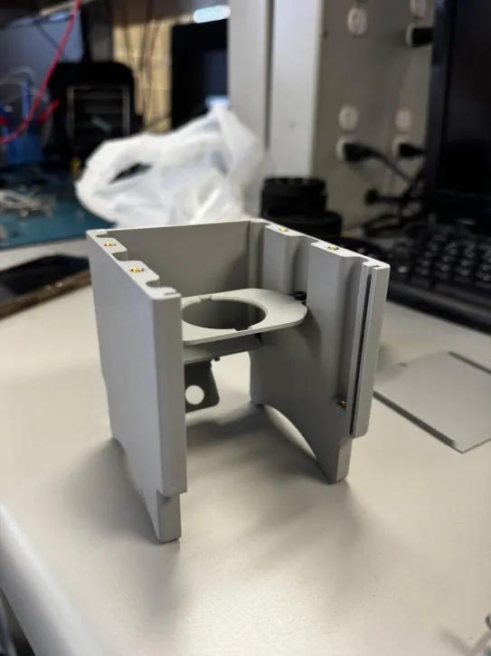</td>
</tr>
<tr>
<td>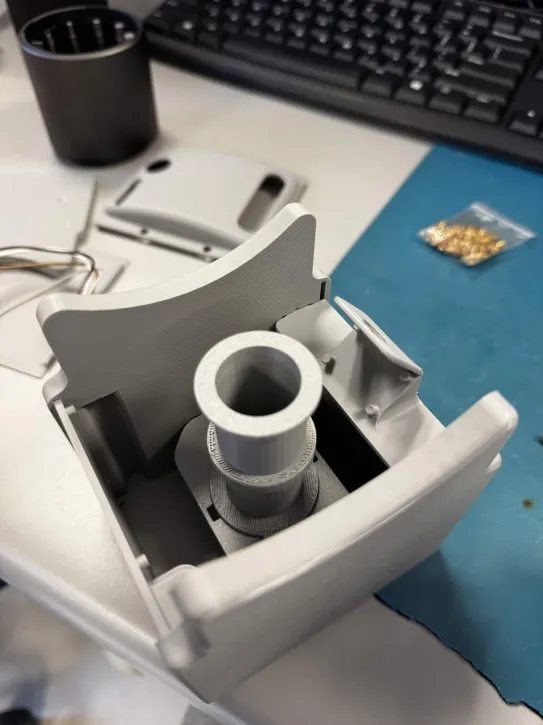</td>
<td>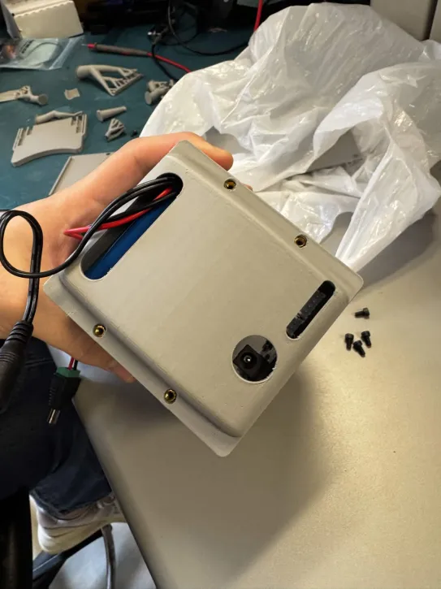</td>
<td>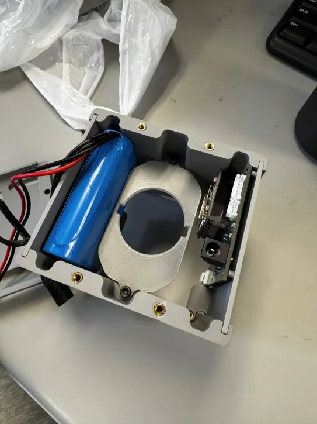</td>
</tr>
</table>
