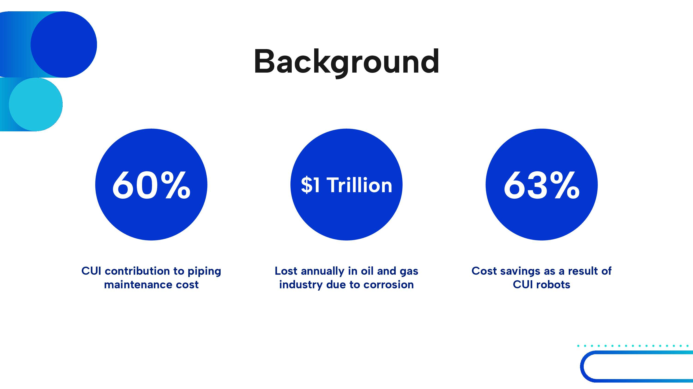
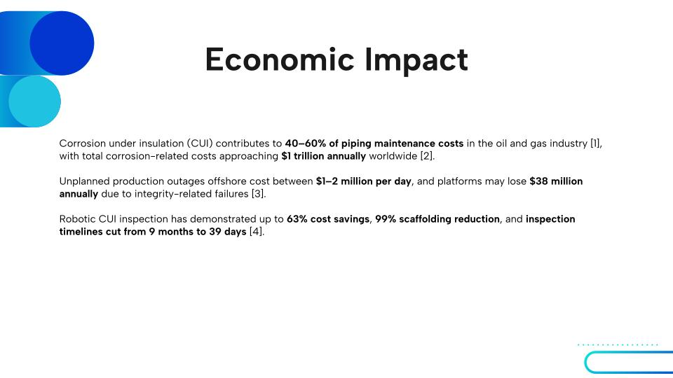
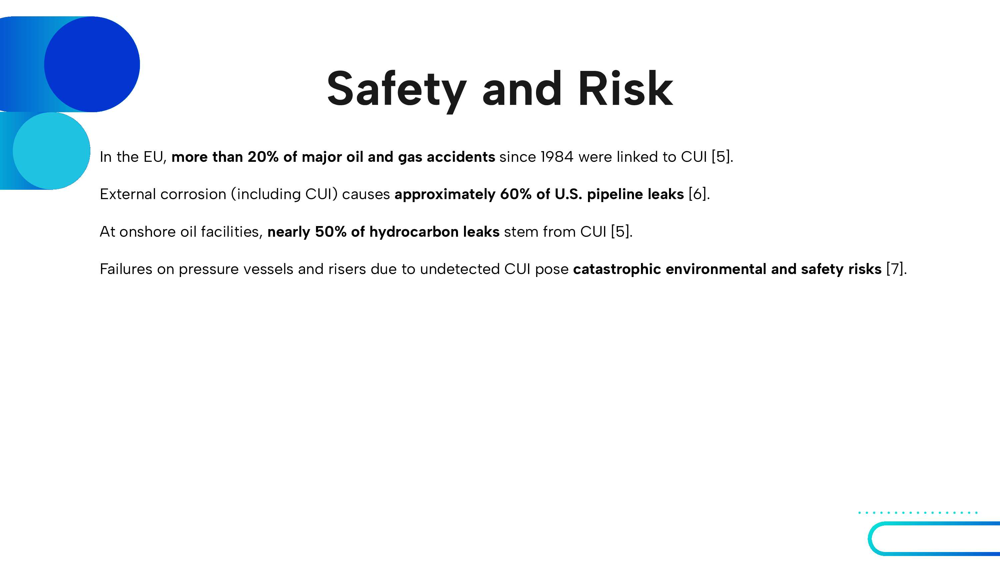
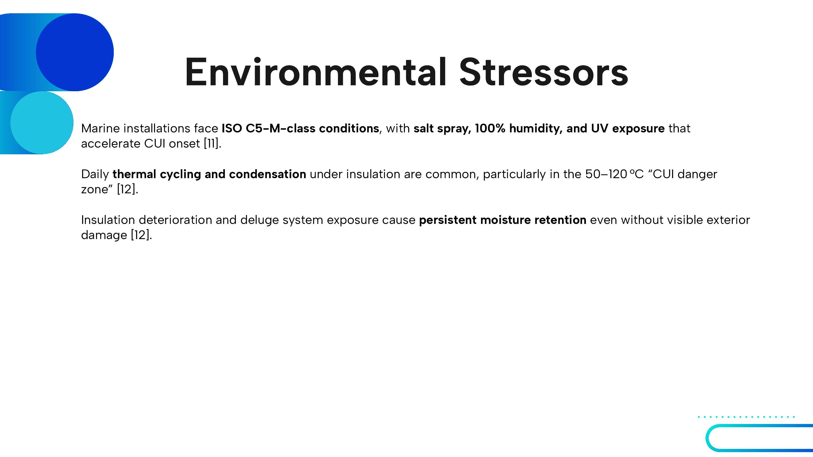
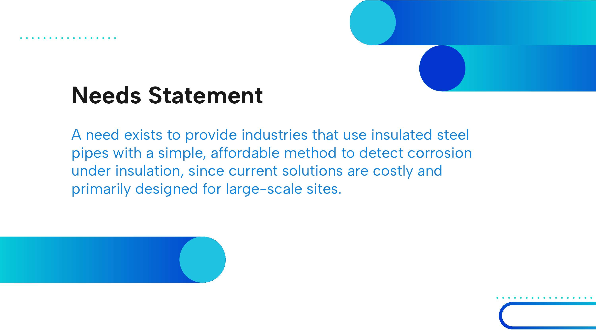
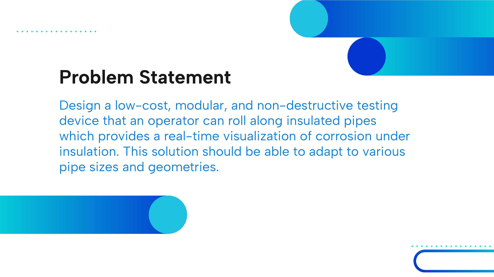
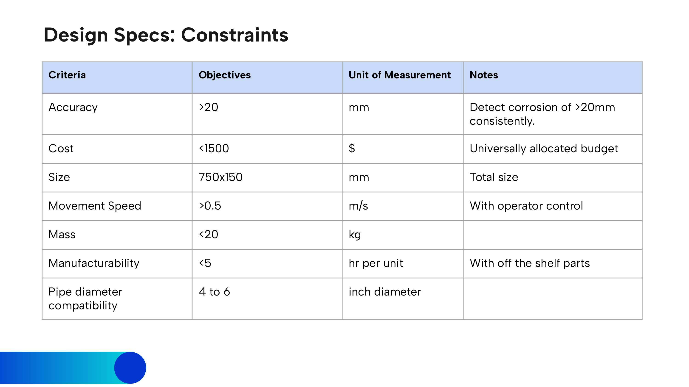
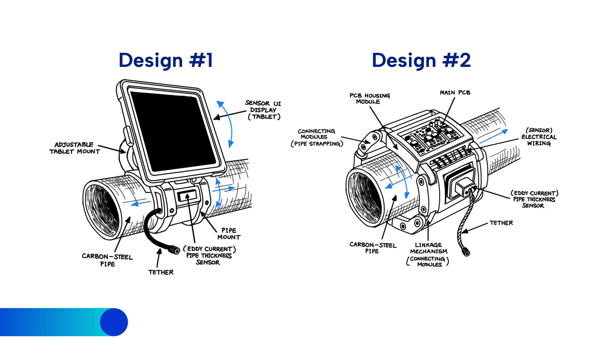
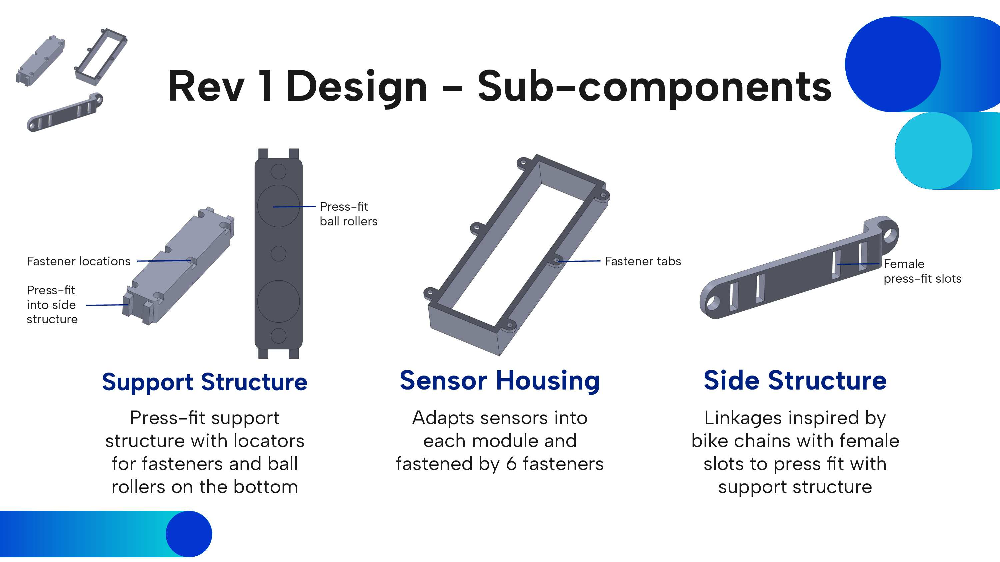
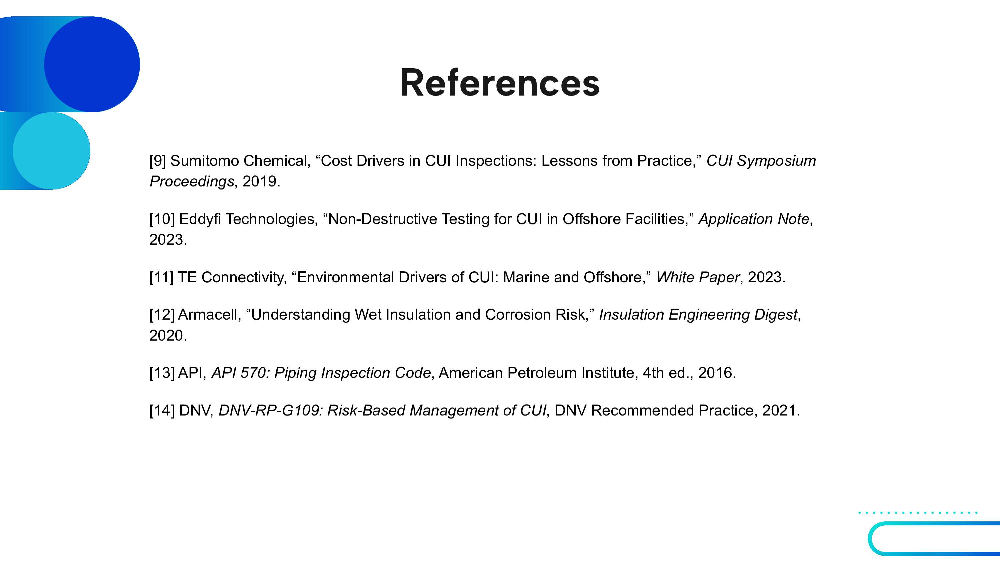

# Week 10 – Nov 3, 2025

## Background research

   
   
   
   
   
   
   
   

---

## Needs & Problem statement

   
   

---

## Criteria || Objectives || Constraints

   
   
   

---

## Designs

   

---

## Patent research

   

---

## Design - Rev.1

   
   
   
   

---

## References

   
   

