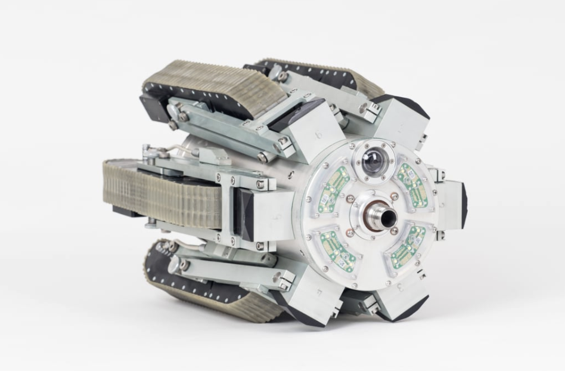
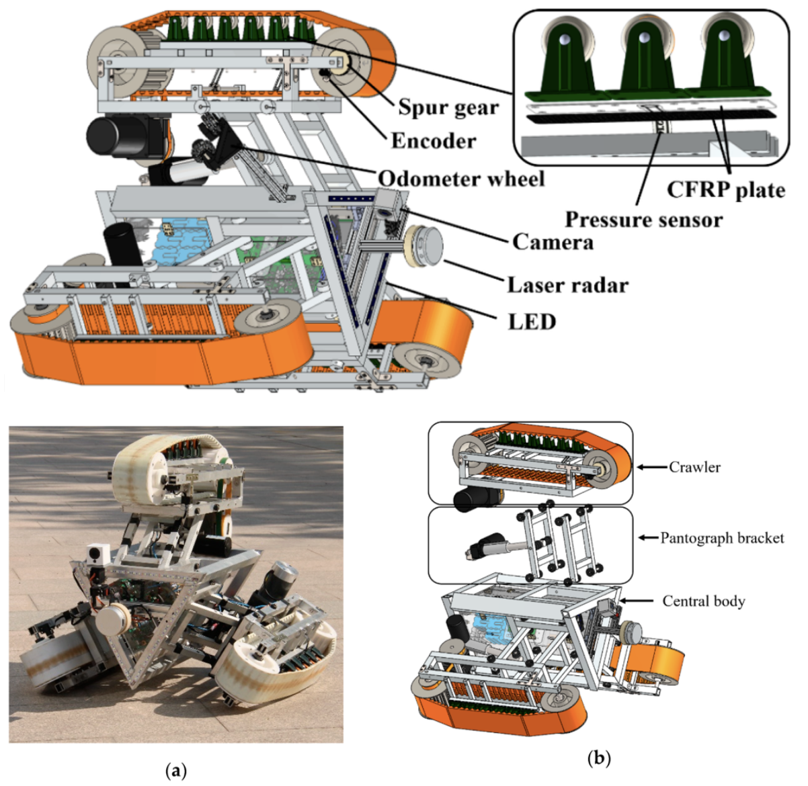
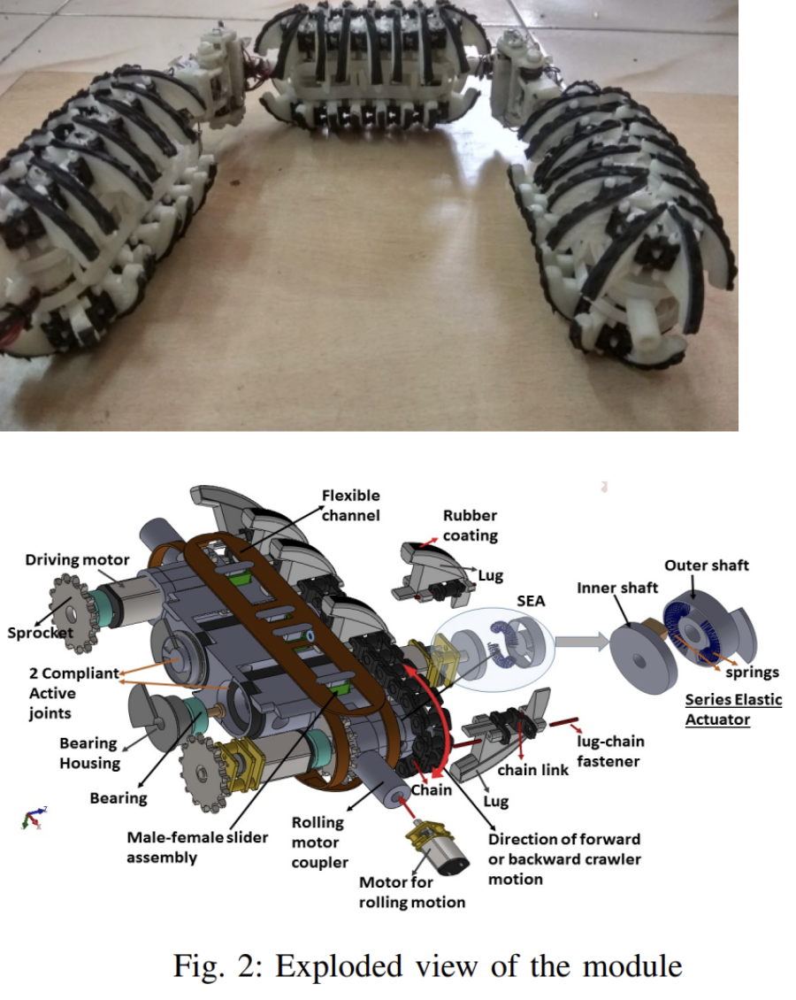
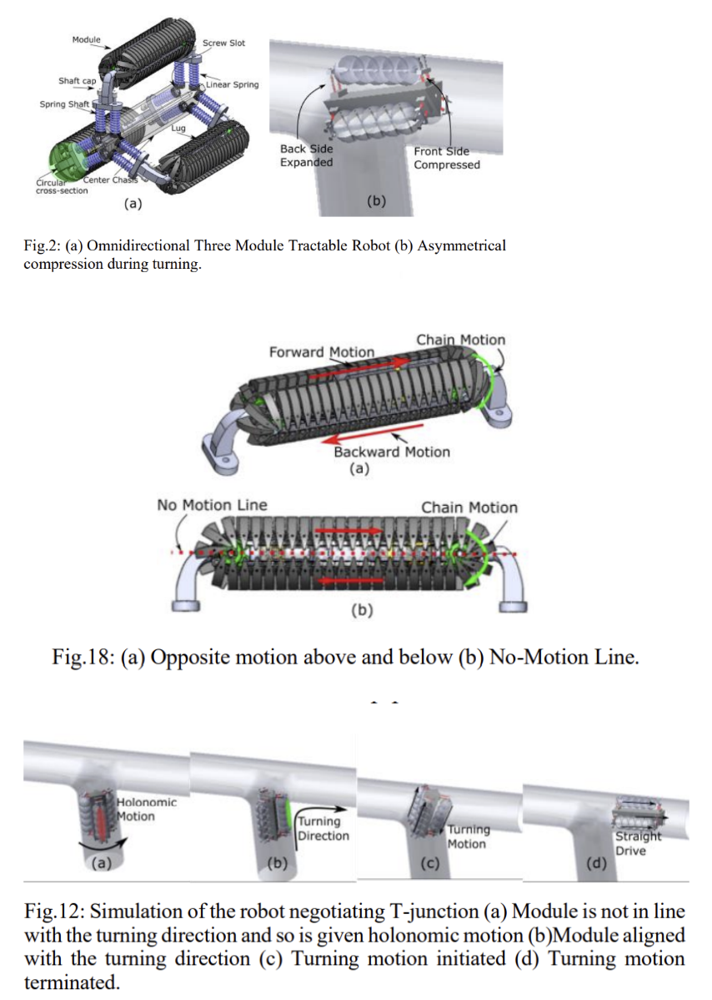

Performed individual research on relevant industry trends and existing patents. Collaboratively completed a needs analysis (objectives, constraints, and criteria) and discussed potential challenges.

Visit here for details:
- [Needs Pitch PDF](https://github.com/warisz/mte-capstone/blob/f968de8cd1b1466b248542422659c415c2c480a8/09_24_MTE481_Needs_Pitch.pdf)
- [Concept Design and Desicion Matrix](https://github.com/warisz/mte-capstone/blob/131c8f04f597d9f97a5b4bb3ea7d4e5839920454/Capstone%20Concept%20Decision%20Matrix.pdf)

## Patent Research: 

1) Jetty Robot 6 
https://www.jettyrobot.com/ 
- Robot designed for cleaning 350mm up to 1350mm diameter pipes 
- Includes different modular cleaning apparatuses, reducing the need for manual access of the pipes or dismantling pipes 

 
Key takeaways 
- Modularity of cleaning tools 
- Tool head can be switched out to accept modules for dry ice blasting, brush cleaning, compressed air, vacuum, abrasive blasting and high-pressure water jetting 
- Modularity allows for cleaning of different fouling/scaling  
- Self-centering mechanism 
- Radial tank treads that push outwards expand against the pipe walls centering the main body allowing for equal cleaning force all around 
- Cleaning trade-offs 
- Dry ice blasting (standard) – removes deposits without surface damage. 
- Brushes / abrasives – mechanical removal of scale. 
- High-pressure water jetting – optional for heavy fouling. 
- Compressed air / vacuuming – debris removal. 

Tether: 
- Yes — carries power, communication, and media (air, water, dry ice pellets). Robot must generate significant pulling force to overcome hose/cable drag. 

Lessons/Challenges for Future Design 
- Managing robot traction vs tether drag especially on vertical sections 
- Keeping the main body of the robot centered 
- Offering multiple different cleaning apparatuses 

2) Design and Analysis of Independently Adjustable Large In-Pipe Robot for Long-Distance Pipeline 
https://www.mdpi.com/2076-3417/10/10/3637 

Key takeaways 
- Cables increase the robot’s running friction 
- Pantograph bracket 
    - One non-powered bracket, the other bracket is hydraulically supported 
    - Two bar linkage system 
    - Can independently adjust the pressure that each leg is exerting on the inner wall of the pipe. This ensures the robot is always centered.  
    - One electric motor that powers one of the two parallel brackets 
- Because of the pantograph bracket, robot can adjust its shape rapidly 
- Self-adjusting capabilities using a self-check system using a perimeter lidar mounted on the front and pressure sensors mounted on each of the tracks 

3) Compliant OmniCrawler In-pipeline Robot 
https://arxiv.org/pdf/1704.06817 

- A climbing robot with compliant foldable OmniCrawler modules (uses circular cross-section crawler tracks) 
- Three OmniCrawler modules are connected end-to-end via links with passive joints. 
- These joints include torsion springs, which provide clamping force against the pipe walls 
- The design allows pipe diameter changes 
- The robot uses a rolling motion in bends 
- Uses holonomic motion  

What makes the design good:
- Enables smooth traversal through tight bends and pipe diameter variations 
- Uses quasi-static model which helps reduce energy consumption (rather than using actuation) 
- Improved traction on low-friction surfaces (with better contact and grip than simple wheels) 
- Holonomic motion allows high success rates at T-junctions 

Potential Challenges:
- Performance drops if the pipe is oily, wet, etc. (“They get stuck on the uneven pipe surface and experience the problem of wheel slip in low friction surface.”) 
- Spring-based compliance tuning may require recalibration with different pipe size 
- Cannot translate sideways/diagonally sorry im still working on it 

4) OmniDirectional Tractable Three Module Robot 
https://arxiv.org/pdf/1909.10277 
- Three-modules spaced 120degrees apart from each other around the pipe interior 
- Each module rotates about its own axis -> allows the robot to reorient itself inside the pipe and adjust heading 

What makes the design good:
- Holonomic motion allows high success rates at T-junctions => useful in tight junctions 
- Can move sideways (due to using omnidirectional drive modules) 

Potential Challenges:
- Complex control system (requires synchronized actuation and real-time feedback) 
- The three modules and their rotation might limit how tight bends can be and how small the robot can be 

5) US10981203B2 Single-Drive Bidirectional Pipe Cleaning Robot 
https://patents.google.com/patent/US10981203B2/en 

S. Liu, Q. Xie, H. Jiang, et al., "Single-drive bidirectional-crawling pipe-cleaning robot," U.S. Patent 10,981,203 B2, Apr. 20, 2021 

- Active patent status (as of 2021) provides commercial protection for the core telescopic-cam-synchronized cleaning technology 
- Patent protection extends across multiple jurisdictions including US, China, Japan, Germany, and World Intellectual Property Organization coverage 
- Bidirectional locomotion capability allows robot to nav forward and back through pipe networks manual repositioning or retrieval from human 
- Three point contact during movement while one arm extends for anchoring and the other retracts to move forward 
- Mech design allows for maintenance and component replacement without complete system disassembly since all components are pretty modular 
- Since it pushes itself, dependency on external systems or remote power sources is not as great so it can be more autonomous in confined pipes 
- The equal dwell cam setup keeps the timing tight between the telescoping arms and the cutter head 
- It’s built for pipes with changing diameters but does not specify 
- The sync means they don’t need other electronics to keep the timing right 
- The telescoping arms let it adjust to different diameters 
- Everything runs off a single motor, which keeps the design simple, no need for multiple drive systems. one motor powers both propulsion and cleaning 
- The cutter head stays in sync with the crawling movement, so debris gets cleared continuously while moving forward 
- Cutter/scraper is used to clean  

## Design Concept & Decision Matrix

